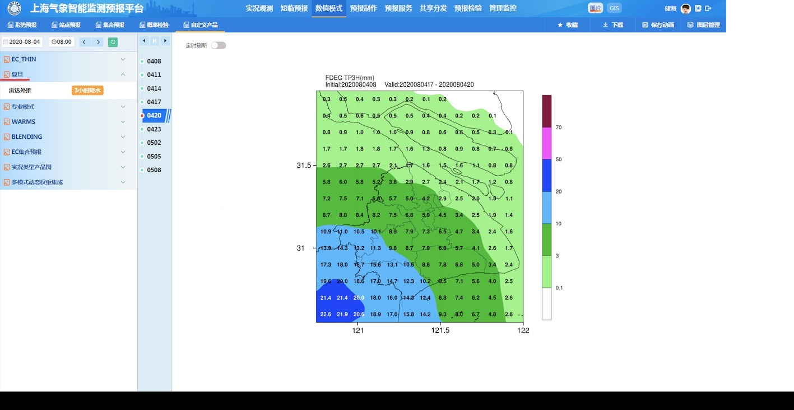
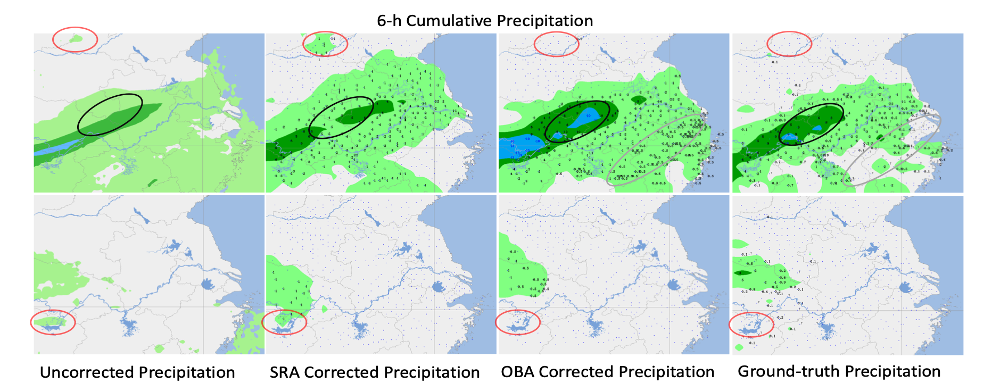

# SSAS: Spatiotemporal Scale Adaptive Selection for Improving Bias Correction on Precipitation (continue to be updated)
  We developed a novel deep-learning-based model for postprocessing the precipitation numerical forecasting called Spatiotemporal Scale Adaptive Selection.


[[Paper](https://xxx.org/pdf/xxx.pdf)]
[[HR-ECMWF](https://www.ecmwf.int/en/forecasts/documentation-and-support)]
[[ERA5](https://cds.climate.copernicus.eu/cdsapp#!/dataset/reanalysis-era5-single-levels-monthly-means?tab=form)]

The intermediate features from the HR-ECMWF and ERA5 linked below via the process of preprocessing can be downloaded after approval. 

## Useage
 We provide run.sh (bash run.sh) to train and test the specified precipitation corrector according to assign the ``SNM ID''.
```python
python -m torch.distributed.launch --nproc_per_node=<NODE NUM> --master_port=<PORT ID> main.py -d <GPU ID> -m <SNM ID> -c ./config/SHO.yaml
```
```python
E.G. when runing SSAS: python -m torch.distributed.launch --nproc_per_node=2 --master_port=88889 main.py -d 7 8 -m 0 -c ./config/SHO.yaml
```

## <SNM ID> -> select the ID of model listed below, and then remove the corresponding comment line in the ``run.sh'' to run the corrector. 
  
0: SSAS

1: SAS (ablation)

2: STS (ablation)

3: OBA

4: FPN

5: CNN

6: LSTM (ConvLSTM)

7: MLR (ANN)

8: LR

9: SVR

10: RF

11: Bayesian

12: IFS

13: TPN

14: T-GCN

15: DA-RNN


## Citation

```bibtex
to be added...
```
## Qualitative results
### Predictions of Lekima typhoon

### Real-time systems on Shanghai Central Meteorology Observatory (SCMO)

### Results of bias correction


