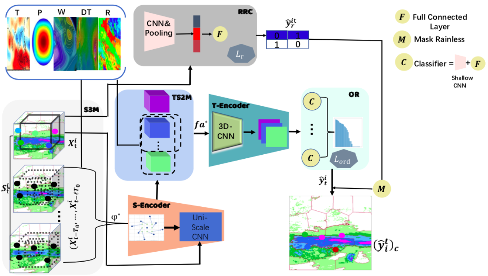
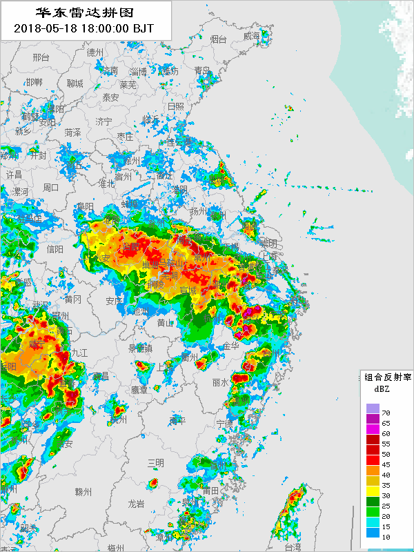
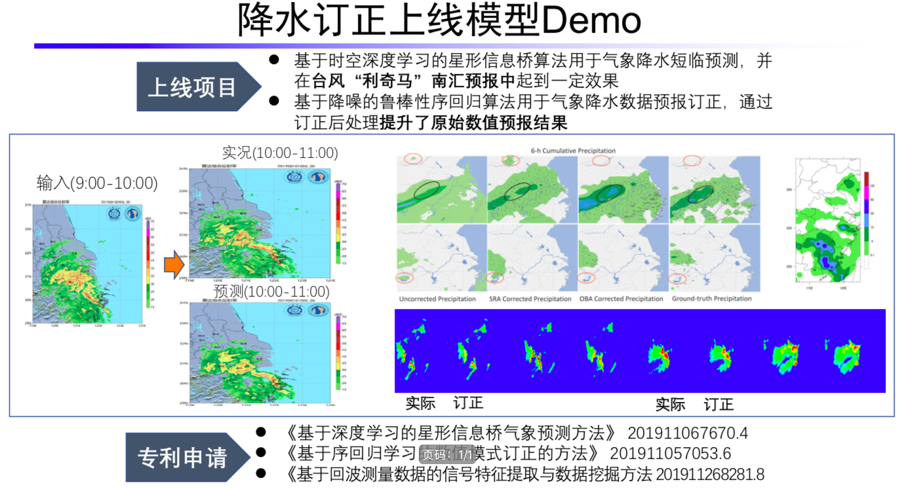
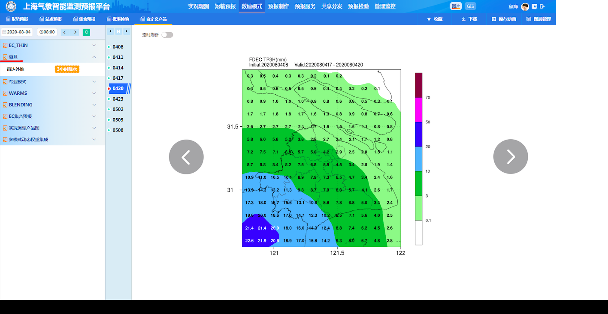

# SSAS: Spatiotemporal Scale Adaptive Selection for Improving Bias Correction on Precipitation (Continue to be updated)
  We developed a novel deep-learning-based model for postprocessing the precipitation numerical forecasting called Spatiotemporal Scale Adaptive Selection.


[[Paper](https://xxx.org/pdf/xxx.pdf)]
[[HR-ECMWF](https://xxx.github.io/xxx/)]
[[ERA5](https://xxx.github.io/xxx/)]

## Useage
 We provide run.sh (bash run.sh) to train and test a precipitation corrector according to the Serial Number of Models (SNM).
```python
python -m torch.distributed.launch --nproc_per_node=<NODE NUM> --master_port=<PORT ID> main.py -d <GPU ID> -m <SNM ID> -c ./config/SHO.yaml
```

## <SNM ID> -> select the corresponding ID for runing the listed models below. 
  
0: SSAS

1: SAS (ablation)

2: STS (ablation)

3: OBA

4: FPN

5: CNN

6: LSTM (ConvLSTM)

7: MLR

8: LR

9: SVR

10: RF

11: Bayesian

12: IFS

13: TPN

14: T-GCN

15: DA-RNN

16: xx

## Citation

```bibtex
xxx
```
## Demo




